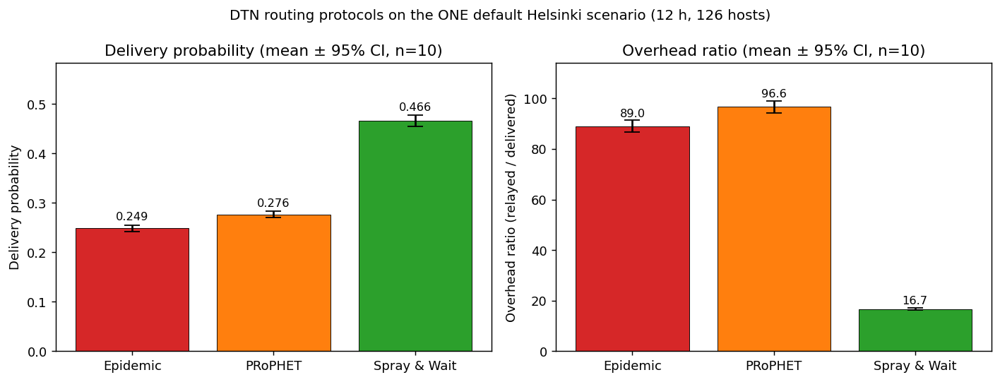
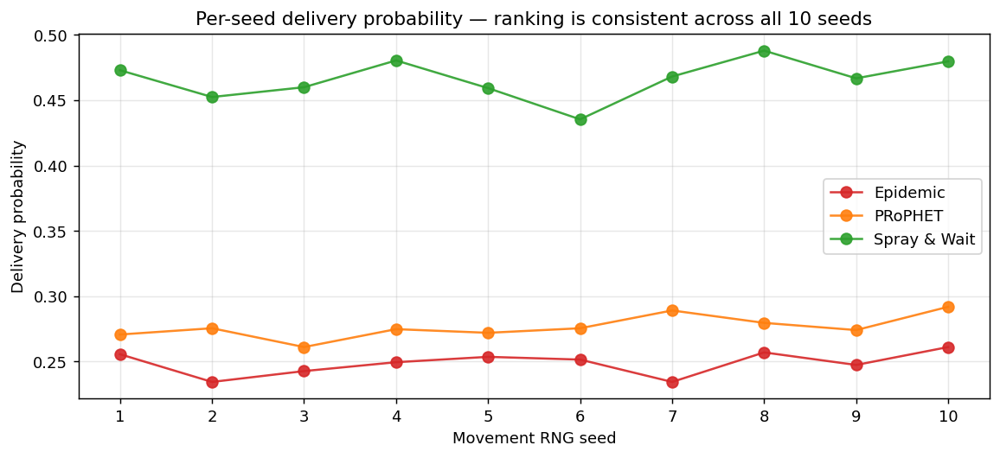

# The ONE

The **Opportunistic Network Environment** simulator — a discrete-time DTN simulator for generating mobility traces and running messaging simulations with various routing protocols. Upstream homepage: <http://akeranen.github.io/the-one/>. Full reference: [the upstream wiki](https://github.com/akeranen/the-one/wiki).

## How it works

The simulator is config-driven, not code-driven. A scenario is described in a plain-text settings file; the engine instantiates the world from that file and advances a tick loop in `Scenario.updateInterval` steps until `Scenario.endTime`.

Four kinds of module plug into the engine by class name from a config file — drop a class into the right package and it becomes usable, no central registry:

- **Movement** (`movement/`) — how nodes move. RandomWaypoint, MapBasedMovement, ShortestPathMapBasedMovement, MapRouteMovement, ExternalMovement.
- **Routing** (`routing/`) — how messages are forwarded between nodes. Epidemic, PRoPHET, Spray and Wait, MaxProp, FirstContact, DirectDelivery, plus a passive router for external routing simulators.
- **Interfaces** (`interfaces/`) — radio model (range, bandwidth).
- **Reports** (`report/`) — per-run output written under `Report.reportDir`.

Map data is loaded from WKT files in `data/`; example scenarios live in `example_settings/`. **Run indexing** (`key = [a; b; c]`) lets one config file describe many runs and is how multi-seed sweeps are expressed.

Two run modes: GUI (`one.bat` / `one.sh`) and headless batch (`-b <count>`).

## Build & run

Java 6+ JDK. Both `lib/ECLA.jar` and `lib/DTNConsoleConnection.jar` must be present at compile and run time — fetch from [upstream `lib/`](https://github.com/akeranen/the-one/tree/master/lib) if missing.

```
compile.bat                  (or ./compile.sh on Unix)
one.bat                      (GUI)
one.bat -b 1 example_settings/epidemic_settings.txt   (batch)
```

Verified locally with Temurin OpenJDK 17.0.19.

## Results

A protocol comparison ran on the bundled default Helsinki scenario (12-hour sim, 4500×3400 m world, 126 hosts across pedestrians/cars/trams, 1463 messages of 500 KB–1 MB on a 25–35 s creation interval). Only the routing module differs between runs. Each protocol was run with **10 movement-RNG seeds**; figures are mean ± 95 % CI (Student t, n=10).



| Routing protocol | Delivery prob | Overhead ratio | Avg latency (s) | Avg hopcount | Avg delivered (of 1463) | Avg dropped |
|---|---|---|---|---|---|---|
| Epidemic | **0.2487 ± 0.0065** | **89.0 ± 2.3** | 4513 ± 153 | 4.57 ± 0.17 | 364 ± 10 | 32 678 ± 619 |
| PRoPHET  | **0.2764 ± 0.0063** | **96.6 ± 2.4** | 4154 ± 98 | 3.60 ± 0.09 | 404 ± 9 | 39 417 ± 785 |
| Spray and Wait | **0.4664 ± 0.0110** | **16.67 ± 0.42** | 2987 ± 100 | 2.43 ± 0.02 | 682 ± 16 | 11 850 ± 83 |

Spray and Wait dominates on every axis — roughly 1.9× the delivery of Epidemic with about 1/5th the overhead — because its bounded copy count (`nrofCopies = 6`) avoids the buffer thrashing that flooding routers cause: Epidemic and PRoPHET drop 30–40 k messages per run versus ~12 k for SnW. PRoPHET edges Epidemic on delivery and hop count but pays for its forwarding decisions with the highest overhead of the three.



The 95 % CIs do not overlap for any pairwise comparison on delivery or overhead, and the protocol ranking holds in every single seed — so **SnW > PRoPHET > Epidemic** on this scenario is statistically distinguishable, not a sampling artefact.

The sweep uses a small `.tools/multi_seed.txt` override (`MovementModel.rngSeed = [1; …; 10]` plus a seed-suffixed `Scenario.name`) chained after each protocol config; plots are regenerated from the raw reports with `.tools/plot_results.py`.

```
one.bat -b 10 example_settings/epidemic_settings.txt .tools/multi_seed.txt
```

## Caveats

Results are specific to this scenario (Helsinki map, 5 MB buffers, default TTL, only `MovementModel.rngSeed` varied). DTN routing rankings are famously scenario-dependent — increase the buffers and the flooders catch up; halve the TTL and SnW's lead widens.
