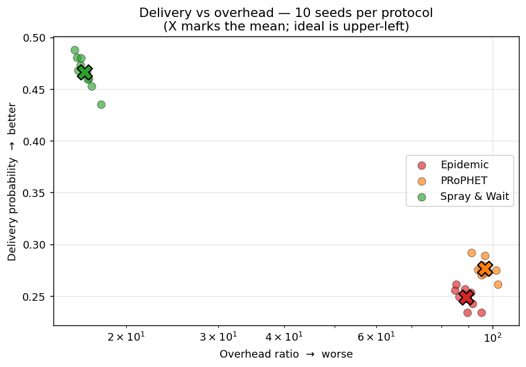

# The ONE

The Opportunistic Network Environment simulator (v1.6.0). A discrete-time DTN/opportunistic-networking simulator that generates mobility traces, runs DTN messaging simulations with various routing protocols, and visualises results.

- Homepage: <http://akeranen.github.io/the-one/>
- Wiki (upstream): <https://github.com/akeranen/the-one/wiki>

---

## Local build & sample runs

Verified on this checkout with Temurin OpenJDK 17.0.19 on Windows 11. Build with the bundled script, then launch a batch simulation:

```
compile.bat                          (or ./compile.sh on Unix)
java -Xmx512M -cp "target;lib/ECLA.jar;lib/DTNConsoleConnection.jar" core.DTNSim -b 1 example_settings/<config>.txt
```

Both `lib/ECLA.jar` and `lib/DTNConsoleConnection.jar` are required at compile and run time; if missing, fetch them from the upstream [akeranen/the-one](https://github.com/akeranen/the-one/tree/master/lib) repository.

### Sample results





Scenario shared across all runs: the default Helsinki setup from `default_settings.txt` (12-hour sim, 4500×3400 m world, 126 hosts across 6 groups including pedestrians, cars and trams; `MessageEventGenerator` creating 1463 messages of 500 KB–1 MB on a 25–35 s interval). Only the routing module differs. Each protocol was run with **10 movement-RNG seeds** (`MovementModel.rngSeed = [1; 2; …; 10]`); figures below are seed mean ± 95 % CI (Student t, n=10, two-tailed).

| Routing protocol | Delivery prob | Overhead ratio | Avg latency (s) | Avg hopcount | Avg delivered (of 1463) | Avg dropped |
|---|---|---|---|---|---|---|
| Epidemic | **0.2487 ± 0.0065** | **89.0 ± 2.3** | 4513 ± 153 | 4.57 ± 0.17 | 364 ± 10 | 32 678 ± 619 |
| PRoPHET  | **0.2764 ± 0.0063** | **96.6 ± 2.4** | 4154 ± 98 | 3.60 ± 0.09 | 404 ± 9 | 39 417 ± 785 |
| Spray and Wait | **0.4664 ± 0.0110** | **16.67 ± 0.42** | 2987 ± 100 | 2.43 ± 0.02 | 682 ± 16 | 11 850 ± 83 |

Spray and Wait dominates this scenario on every axis — roughly 1.9× the delivery probability of Epidemic with about 1/5th the overhead and lower latency — because its bounded copy count (`nrofCopies = 6` in `snw_settings.txt`) avoids the buffer thrashing the flooding routers cause: Epidemic and PRoPHET each drop 30–40 k messages per run versus ~12 k for SnW. PRoPHET consistently edges Epidemic on delivery and hop count but pays for its forwarding decisions with the highest overhead of the three.

The 95 % CIs do not overlap for any pairwise comparison on delivery probability or overhead ratio, so the **SnW > PRoPHET > Epidemic** ranking is statistically distinguishable, not a sampling artefact. Relative CI half-widths are ≤3 % for every metric, indicating the scenario is well-mixed and 10 seeds is sufficient for protocol comparison.

The multi-seed runs use a small `.tools/multi_seed.txt` override (`MovementModel.rngSeed = [1; …; 10]` plus a seed-suffixed `Scenario.name` via value-filling) chained after each protocol config — e.g.:

```
java -Xmx512M -cp "target;lib/ECLA.jar;lib/DTNConsoleConnection.jar" core.DTNSim -b 10 example_settings/epidemic_settings.txt .tools/multi_seed.txt
```

---

# Reference manual

## Quick start

### Compiling

You can compile ONE from the source code using the included `compile.bat` script. That should work both in Windows and Unix/Linux environment with Java 6 JDK or later. (The bundled scripts pass `-cp lib/...` directly so they work on modern JDKs that removed `-extdirs`.)

If you want to use Eclipse for compiling the ONE, since version 1.1.0 you need to include some jar libraries in the project's build path. The libraries are located in the `lib` folder. To include them in Eclipse, assuming that you have an Eclipse Java project whose root folder is the folder where you extracted the ONE, do the following:

1. select from menus: **Project → Properties → Java Build Path**
2. Go to "Libraries" tab
3. Click "Add JARs..."
4. Select `DTNConsoleConnection.jar` under the `lib` folder
5. Add the `ECLA.jar` the same way
6. Press "OK".

Now Eclipse should be able to compile the ONE without warnings.

### Running

ONE can be started using the included `one.bat` (for Windows) or `one.sh` (for Linux/Unix) script. Following examples assume you're using the Linux/Unix script (just replace `./one.sh` with `one.bat` for Windows).

Synopsis:

```
./one.sh [-b runcount] [conf-files]
```

Options:

- `-b` — Run simulation in batch mode. Doesn't start GUI but prints information about the progress to terminal. The option must be followed by the number of runs to perform in the batch mode or by a range of runs to perform, delimited with a colon (e.g. value `2:4` would perform runs 2, 3 and 4). See section "Run indexing" for more information.

Parameters:

- `conf-files` — The configuration file names where simulation parameters are read from. Any number of configuration files can be defined and they are read in the order given on the command line. Values in later config files override values in earlier config files.

## Configuring

All simulation parameters are given using configuration files. These files are normal text files that contain key-value pairs. Syntax for most of the variables is:

```
Namespace.key = value
```

I.e., the key is (usually) prefixed by a namespace, followed by a dot, and then key name. Key and value are separated by equals-sign. Namespaces start with capital letter and both namespace and keys are written in CamelCase (and are case sensitive). Namespace defines (loosely) the part of the simulation environment where the setting has effect on. Many, but not all, namespaces are equal to the class name where they are read. Especially movement models, report modules and routing modules follow this convention. In some cases the namespace is defined by the user: e.g., with network interfaces the user can pick any identifier, define interface-specific settings in that namespace, and give the name of the namespace when configuring which interface each group should use.

Numeric values use `.` as the decimal separator and can be suffixed with kilo (`k`), mega (`M`) or giga (`G`). Boolean settings accept `true`, `false`, `0`, and `1` as values.

Many settings define paths to external data files. The paths can be relative or absolute but the directory separator must be `/` in both Unix and Windows environment.

Some variables contain comma-separated values, and for them the syntax is:

```
Namespace.key = value1, value2, value3, etc.
```

For run-indexed values the syntax is:

```
Namespace.key = [run1value; run2value; run3value; etc]
```

I.e., all values are given in brackets and values for different run are separated by semicolon. Each value can also be a comma-separated value. For more information about run indexing, see [Run indexing](#run-indexing).

Setting files can contain comments too. A comment line must start with `#` character. Rest of the line is skipped when the settings are read. This is useful for disabling settings easily.

Some values (scenario and report names at the moment) support **value filling**. With this feature, you can construct e.g. scenario name dynamically from setting values. This is especially useful when using run indexing. Put setting key names in the value part prefixed and suffixed by two percent (`%`) signs; these placeholders are replaced by the current setting value from the configuration file. See `snw_comparison_settings.txt` for an example.

`default_settings.txt`, if it exists, is always read; the other configuration files given as parameters can define more settings or override settings in previous files. The idea is to define in earlier files all settings common to all simulations and run different specific simulations using different configuration files.

### Run indexing

Run indexing lets you run large numbers of different configurations from a single configuration file. Provide an array of settings (using the syntax above) for the variables that should change between runs. For example, to run with five different random number generator seeds for movement models:

```
MovementModel.rngSeed = [1; 2; 3; 4; 5]
```

Now if you run:

```
./one.sh -b 5 my_config.txt
```

the first run uses seed 1 (run index 0), the next uses seed 2, etc. You must run in batch mode (`-b`) to use different values; without `-b` the first parameter (if numeric) is the run index to use in GUI mode.

Run indexes wrap around: value used is `(runIndex % arrayLength)`. Because of wrapping, you can easily run large numbers of permutations. For example with:

```
key1 = [1; 2]
key2 = [a; b; c]
```

and run-index count 6, you would get all permutations `(1,a; 2,b; 1,c; 2,a; 1,b; 2,c)`. Make sure the smallest common nominator of all array sizes is 1 (e.g. use array sizes that are coprime) — unless you don't want all permutations but some values to be paired.

### Movement models

Movement models govern the way nodes move in the simulation. They provide coordinates, speeds and pause times for the nodes. The basic installation contains random waypoint, map based movement, shortest path map based movement, map route movement and external movement. All these models, except external movement, have configurable speed and pause time distributions. A minimum and maximum value can be given and the movement model draws uniformly distributed random values from that range. Same applies for pause times. In external movement model the speeds and pause times are interpreted from the given data.

- **RandomWaypoint** — a node gets a random coordinate in the simulation area, moves directly to it at constant speed, pauses for a while, then gets a new destination.
- **MapBasedMovement** — constrains movement to predefined paths. Initially distributes nodes between any two adjacent map nodes; they then move from adjacent map node to another, choosing the previous one only if it is the sole option (avoids going back). After traversing 10–100 map nodes they pause for a while, then resume.
- **ShortestPathMapBasedMovement** — uses Dijkstra's algorithm to find paths through the map area; once a node reaches its destination and waits the pause time, a new random map node is chosen and the node moves there using shortest path through valid map nodes.
- **MapRouteMovement** — models nodes that follow certain routes, e.g. bus or tram lines. Define only the stops; nodes move stop-to-stop via shortest paths and pause for the configured time at each stop.
- **ExternalMovement** — reads timestamped node locations from a file (experimental). See javadocs of `ExternalMovementReader` in the input package for the format. A converter script (`transimsParser.pl`) for TRANSIMS data is included in `toolkit/`.

For shortest-path-based models the map data can also contain Points Of Interest (POIs). Instead of selecting any random map node, the movement model can be configured to give a POI from a certain POI group with configurable probability. Any number of POI groups can be defined with any number of POIs each; per-group probabilities can be set per host group. POIs can model shops, restaurants, tourist attractions, etc.

Different map types are defined by storing paths in different files (selected per group via `okMaps`). POIs are defined with the WKT `POINT` directive; POI groups by storing POIs in the same file. All POIs must be part of the map data so they are reachable. Route stops are defined with `LINESTRING` and traversed in order; one WKT file can contain multiple routes, given to nodes in the order they appear in the file.

All movement models can decide when a node is active (and connectable). Multiple simulation-time intervals can be given and nodes in that group will be active only during those times. (External movement excepted.)

All map-based models read their input from files in a subset of the Well Known Text (WKT) format. `LINESTRING` and `MULTILINESTRING` directives are supported for path data; the `POINT` directive is supported for point data. Adjacent vertices in a `(MULTI)LINESTRING` form a path; if two lines share an exact vertex, the paths join (this is how intersections are created). WKT files can be edited and generated from real-world map data using any GIS program. The map data included with the simulator was converted and edited in OpenJUMP.

The movement model to use is defined per node group with the `movementModel` setting. The value must be a valid movement model class name from the `movement` package. Settings common to all models are read in `MovementModel`; model-specific settings are read in the respective classes. See javadocs and example configurations for details.

### Routing modules and message creation

Routing modules define how messages are handled in the simulation. Six basic active routing modules (First Contact, Epidemic, Spray and Wait, Direct delivery, PRoPHET and MaxProp) plus a passive router for external routing simulation are included. The active routing modules are implementations of well-known DTN routing algorithms. Variants and additional models are included in later versions; see `routing/` for details.

Passive router is for interacting with other (DTN) routing simulators or running simulations that don't need routing. It does nothing unless commanded by external events. These events are provided to the simulator by a class implementing the `EventQueue` interface.

There are two basic classes that can be used as a source of message events: `ExternalEventsQueue` and `MessageEventGenerator`. The former reads events from a file that can be created by hand, by a script (e.g. `createCreates.pl` in `toolkit/`), or by converting e.g. dtnsim2's output. See `StandardEventsReader` (input package) for the format. `MessageEventGenerator` is a simple class creating uniformly distributed message creation patterns with configurable interval, size, and source/destination host ranges. More specific scenarios can be created with `MessageBurstGenerator` and `One{From,To}EachMessageGenerator`. See javadocs for details.

The toolkit folder contains an experimental parser script (`dtnsim2parser.pl`) for dtnsim2's output (there used to be a more capable Java-based parser but it was discarded in favour of this more easily extendable script). The script requires a few patches to dtnsim2's code in `toolkit/dtnsim2patches/`.

The routing module to use is defined per node group with the `router` setting. All routers can't interact properly (e.g. PRoPHET can only work with other PRoPHET), so usually it makes sense to use the same (or compatible) router for all groups.

### Reports

Reports create summary data of simulation runs, detailed data of connections and messages, files suitable for post-processing (e.g. with Graphviz), or interface with other programs. See javadocs of `report` package classes for details.

There can be any number of reports per simulation run; the count is defined with `Report.nrofReports`. Report class names are defined with `Report.reportN` where `N` is a positive integer starting from 1. Values must be valid report class names from the `report` package. The output directory of all reports (overridable per report class with the `output` setting) is defined with `Report.reportDir`. If no `output` is given for a report class, the file is named `ReportClassName_ScenarioName.txt`.

All reports have many configurable settings, defined as `ReportClassName.settingKey`. See javadocs of `Report` and specific report classes (look for "setting id" definitions).

### Host groups

A host group is a group of hosts (nodes) sharing movement and routing module settings. Different groups can have different values for the settings and so represent different node types. Base settings are defined in the `Group` namespace; specific groups override or add settings in their own namespaces (`Group1`, `Group2`, …).

## Settings reference

There are far more settings than is meaningful to present here. See javadocs of report, routing and movement model classes for details, and the included settings files for examples. The most important settings follow.

### Scenario settings

| Key | Meaning |
|---|---|
| `Scenario.name` | Name of the scenario. All report files are by default prefixed with this. |
| `Scenario.simulateConnections` | Should connections be simulated. If you're only interested in movement modelling, disable for faster simulation. Usually `true`. |
| `Scenario.updateInterval` | How many seconds are stepped per update. Larger = faster sim, less precise. 0.1–2 are reasonable. |
| `Scenario.endTime` | How many simulated seconds to simulate. |
| `Scenario.nrofHostGroups` | Number of host groups in the simulation. |

### Interface settings

Used to define the interfaces nodes can have.

| Key | Meaning |
|---|---|
| `type` | The class (from the `interfaces` directory) used for this interface. |

Remaining settings are class-specific. Examples:

| Key | Meaning |
|---|---|
| `transmitRange` | Range (meters) of the interface. |
| `transmitSpeed` | Transmit speed of the interface (bytes per second). |

### Host group settings (`Group` or `GroupN` namespace)

| Key | Meaning |
|---|---|
| `groupID` | Group identifier (string/char). Used as prefix of host names in GUI and reports; full name is `groupID+networkAddress`. |
| `nrofHosts` | Number of hosts in this group. |
| `nrofInterfaces` | Number of interfaces the nodes use. |
| `interfaceX` | The interface used as interface number X. |
| `movementModel` | The movement model all hosts in the group use. Must be a subclass of `MovementModel` from the `movement` package. |
| `waitTime` | Minimum and maximum wait time (two comma-separated decimal values, seconds). New random value within the interval drawn at every stop. Default `0,0`. |
| `speed` | Minimum and maximum speed (m/s). New random value at every new path. Default `1,1`. |
| `bufferSize` | Size of nodes' message buffer (bytes). When full, the node must drop old messages before accepting new ones. |
| `router` | Routing module. Must be a subclass of `MessageRouter` from the `routing` package. |
| `activeTimes` | Time intervals (comma-separated tuples: `start1, end1, start2, end2, …`) when nodes are active. If unset, always active. |
| `msgTtl` | Message Time To Live (simulated minutes). Routers check every minute and drop expired messages. If unset, TTL is infinite. |

Group- and movement-model-specific settings (only meaningful for certain movement models):

| Key | Meaning |
|---|---|
| `pois` | POI indexes and probabilities for `ShortestPathMapBasedMovement`-based models. Comma-separated `index, prob, index, prob, …` tuples. If the probabilities sum to less than 1, the remainder is the chance of picking any random map node. |
| `okMaps` | Which map node types (refers to map file indexes) are OK for the group (comma-separated integers). Usable with any `MapBasedMovement`-based model. |
| `routeFile` | If using `MapRouteMovement`, path to the WKT route file containing `LINESTRING` directives. Each vertex is one stop. |
| `routeType` | Route type for `MapRouteMovement`: `1` = circular, `2` = ping-pong. See `movement.map.MapRoute`. |

### Movement model settings

| Key | Meaning |
|---|---|
| `MovementModel.rngSeed` | Seed for all movement models' RNG. With the same seed and settings, nodes move identically across simulations. |
| `MovementModel.worldSize` | Simulation world size in meters (comma-separated width, height). |
| `PointsOfInterest.poiFileN` | WKT file paths where POI coordinates are read from (POINT directive). `N` is a positive integer. |
| `MapBasedMovement.nrofMapFiles` | How many map files to look for. |
| `MapBasedMovement.mapFileN` | Path to the Nth map file (`N` positive integer). All must be WKT files with `LINESTRING`/`MULTILINESTRING`. `POINT` is permitted but skipped (so the same file can serve both). By default, map coordinates are translated so the upper-left corner is at `(0,0)`; Y is mirrored before translation so north points up in the playfield. POI and route files are translated to match. |

### Report settings

| Key | Meaning |
|---|---|
| `Report.nrofReports` | How many report modules to load (defined as `Report.report1`, `Report.report2`, …). Following settings can be defined for all reports (in `Report.` namespace) or per report (in `ReportN.`). |
| `Report.reportDir` | Where to store output files. Absolute or relative path; created if missing. |
| `Report.warmup` | Length of the warm-up period (simulated seconds from start). During warm-up, report modules should discard new events. Behaviour is module-specific — check javadocs. |

### Event generator settings

| Key | Meaning |
|---|---|
| `Events.nrof` | How many event generators are loaded. Specific settings (below) are defined in `EventsN` namespaces (`Events1.settingName` configures generator 1, etc.). |
| `EventsN.class` | Generator class name (e.g. `ExternalEventsQueue`, `MessageEventGenerator`). Must be found in the `input` package. |

For `ExternalEventsQueue` you must at least define `filePath`. See `input.StandardEventsReader` javadocs for the file format.

### Other settings

| Key | Meaning |
|---|---|
| `Optimization.randomizeUpdateOrder` | Should the order in which nodes are updated be randomised. Update causes nodes to check connections and update their routing module. If `false`, update order follows network address; with randomisation it changes each step. |
| `Optimization.cellSizeMult` | Trade-off between memory consumption and simulation speed; especially useful for large maps. See `ConnectivityOptimizer` for details. |

## GUI

The GUI's main window is divided into three parts. The main part contains the playfield view (where node movement is displayed) and simulation/GUI controls. The right part is used to select nodes. The lower part is for logging and breakpoints.

The main part's topmost section is for simulation and GUI controls. First field shows current simulation time. Next field shows simulation speed (simulated seconds per second). The four buttons that follow are pause, step, fast forward, and fast forward to time. Pressing step multiple times runs the simulation step-by-step. Fast forward (FFW) is for skipping uninteresting parts; in FFW the GUI update speed is set to a large value. Next drop-down controls GUI update speed: speed 1 means GUI updates every simulated second, 10 means every 10th, etc. Negative values slow it down. The next drop-down controls zoom factor. The last button saves the current view as a PNG.

The middle section — the playfield view — shows node placement, map paths, node IDs, connections among nodes etc. Nodes are small rectangles; their radio range is a green circle. Group ID and network address (a number) are shown next to each node. If a node is carrying messages, each message is a green or blue filled rectangle. If more than 10 messages are carried, another column of rectangles is drawn for each 10 messages, alternating red. Click the playfield with the mouse to centre the view there. Zoom can be changed with the mouse wheel.

The right side is for picking a node for closer inspection. Clicking a button shows node info in the main part's lower section. From there, more information about any message the node is carrying can be displayed via the drop-down. Pressing "routing info" opens a new window with information about the routing module. When a node is selected, the playfield is centred on it and its current path is shown in red.

The lowest part (logging) is divided into controls and log. From controls you choose which messages are shown and which event types should pause the simulation. The log section shows time-stamped events. All node and message names in log messages are buttons that show more information when clicked.

## DTN2 reference implementation connectivity

DTN2 connectivity allows bundles to be passed between the ONE and any number of DTN2 routers. This is done through DTN2's External Convergence Layer Interface.

When DTN2 connectivity is enabled, ONE connects to `dtnd` routers as an external convergence layer adapter. ONE will also automatically configure `dtnd` through a console connection with a link and route for bundles to reach the simulator.

When a bundle is received from `dtnd`, ONE attempts to match the destination EID against the regular expressions configured in the configuration file (see below). For each matching node a copy of a message is created and routed inside ONE. When the bundle reaches its destination inside ONE it is delivered to the `dtnd` router instance attached to the node. Copies of the bundle payload are stored within the `bundles/` directory.

To enable this functionality:

1. DTN2 must be compiled and configured with ECL support enabled.
2. `DTN2Events` event generator must be configured to be loaded into ONE as an events class.
3. `DTN2Reporter` must be configured and loaded into ONE as a report class.
4. DTN2 connectivity configuration file must be set as `DTN2.configFile`.

To start the simulation:

1. Start all the `dtnd` router instances.
2. Start ONE.

### Example configuration

```
Events.nrof = 1
Events1.class = DTN2Events
Report.nrofReports = 1
Report.report1 = DTN2Reporter
DTN2.configFile = cla.conf
```

### DTN2 connectivity configuration file

Defines which nodes inside ONE connect to which DTN2 router instances. It also defines the EIDs the nodes match. The file is composed of comment lines starting with `#` and configuration lines:

```
<nodeID> <EID regexp> <dtnd host> <ECL port> <console port>
```

| Field | Meaning |
|---|---|
| nodeID | ID of a node inside ONE (integer ≥ 0). |
| EID regexp | Incoming bundles whose destination EID matches this regexp will be forwarded to the node inside ONE (see `java.util.regex.Pattern`). |
| dtnd host | Hostname/IP of the `dtnd` router to connect to this node. |
| ECL port | `dtnd` router's port listening to ECLAs. |
| console port | `dtnd` router's console port. |

Example:

```
# <nodeID> <EID regexp> <dtnd host> <ECL port> <console port>
1 dtn://local-1.dtn/(.*) localhost 8801 5051
2 dtn://local-2.dtn/(.*) localhost 8802 5052
```

### Known issues

For DTN2 connectivity related issues, you can contact <teemuk@netlab.tkk.fi>.

- Quitting `dtnd` router instances connected to ONE will cause ONE to quit.

## Toolkit

The simulation package includes a `toolkit/` folder with scripts for generating input and processing the output of the simulator. All currently included scripts are written in Perl, so you need it installed before running them. Some post-processing scripts use gnuplot. Both are freely available for most Unix/Linux and Windows environments; on Windows you may need to change the path to the executables in some scripts.

| Script | Purpose |
|---|---|
| `getStats.pl` | Bar plots of various statistics gathered by `MessageStatsReport`. Mandatory option `-stat` names the value to parse (e.g. `delivery_prob`); remaining parameters are `MessageStatsReport` output filenames. Produces a values file, gnuplot commands, and an image. One bar per input file; bar title is parsed from the filename via `-label` regexp. `-help` for more. |
| `ccdfPlotter.pl` | Creates Complementary/Inverse Cumulative Distribution Function plots (gnuplot) from reports containing time-hitcount tuples. `-out` for output filename, then report filenames. `-label` for legend extraction regexp. |
| `createCreates.pl` | Generates external-events-file content for message creation patterns. Mandatory: `-nrof` (count), `-time` (range), `-hosts` (range), `-sizes` (range). Ranges are two integers with a colon (`min:max`). Reply size range via `-rsizes`. Optional `-seed`. All random values are drawn uniformly with inclusive min, exclusive max. Output is suitable for an external events file — redirect to a file. |
| `dtnsim2parser.pl`, `transimsParser.pl` | Experimental parsers converting other programs' data to ONE-compatible form. Both take input and output filenames (or use stdin/stdout). `dtnsim2parser` converts dtnsim2's (verbose mode 8) output to an external events file. `transimsParser` converts TRANSIMS vehicle snapshot files to external movement files. |

---

## See also

- `CONTRIBUTING.md` — contribution guidelines.
- `HISTORY.txt` — release history.
- `LICENSE.txt` — license details.
